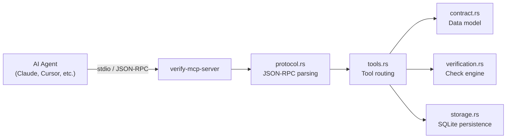

# Project Overview: verify-mcp-server

## What Is This?

A **Rust-based MCP (Model Context Protocol) server** that provides **contract-based verification** for AI agents. It solves the "blind trust" problem — where AI agents accept tool outputs without checking them — by letting agents define expectations *before* work and verify results *after*.

> [!TIP]
> You are already using this server! It's the `verify` MCP server that powers `verify_create_contract`, `verify_run_contract`, and other verification tools.

---

## Project Stats

| Property | Value |
|---|---|
| **Language** | Rust (edition 2021) |
| **Version** | 0.1.0 |
| **License** | MIT |
| **Git** | 1 commit on `main` |
| **Build** | ✅ Compiles with 4 warnings (dead code) |
| **Binary** | `target/release/verify-mcp-server` |
| **Persistence** | SQLite at `~/.local/share/verify-mcp/verify.db` |

---

## Architecture

---

## Source Files

### [main.rs](file:///home/peter/Projekte/verify-mcp-server/src/main.rs) (201 lines)
Entry point. Sets up tracing (to stderr per MCP spec), opens SQLite storage, and runs the stdio JSON-RPC loop. Handles `initialize`, `tools/list`, `tools/call`, and `ping` methods.

### [protocol.rs](file:///home/peter/Projekte/verify-mcp-server/src/protocol.rs) (171 lines)
MCP protocol types: `JsonRpcRequest`, `JsonRpcResponse`, `ToolDefinition`, `ToolResult`, etc. Implements the JSON-RPC 2.0 subset needed for an MCP tool server.

### [contract.rs](file:///home/peter/Projekte/verify-mcp-server/src/contract.rs) (254 lines)
Data model for contracts and checks. Defines:
- `Contract` — a set of expectations with metadata
- `Check` — a single verifiable check with severity
- `CheckType` — the 12 supported check types (commands, files, JSON schema, pytest, import graph, etc.)
- `CheckResult`, `ContractStatus`, `Severity`

### [tools.rs](file:///home/peter/Projekte/verify-mcp-server/src/tools.rs) (595 lines)
MCP tool definitions and call handlers. Exposes 8 tools:

| Tool | Purpose |
|---|---|
| `verify_create_contract` | Define expectations before work |
| `verify_run_contract` | Execute all checks, get verdict |
| `verify_quick_check` | Ad-hoc single check |
| `verify_list_contracts` | List active contracts |
| `verify_get_report` | Detailed markdown report |
| `verify_delete_contract` | Clean up contracts |
| `verify_history` | Browse past verifications |
| `verify_stats` | Aggregate statistics |

### [verification.rs](file:///home/peter/Projekte/verify-mcp-server/src/verification.rs) (1261 lines)
The verification engine — the largest file. Implements all 12 check types:
- **Generic**: `command_succeeds`, `command_output_matches`, `file_exists`, `file_contains_patterns`, `file_excludes_patterns`, `json_schema_valid`, `value_in_range`, `diff_size_limit`, `assertion`
- **Python-specific**: `python_type_check`, `pytest_result`, `python_import_graph`, `json_registry_consistency`

### [storage.rs](file:///home/peter/Projekte/verify-mcp-server/src/storage.rs) (742 lines)
SQLite-backed persistence using `rusqlite`. Stores contracts, check results, and a full audit trail. Supports history queries and aggregate statistics.

---

## Dependencies

| Crate | Purpose |
|---|---|
| `serde` + `serde_json` | JSON serialization |
| `tokio` | Async runtime + process spawning |
| `uuid` | Contract ID generation |
| `chrono` | Timestamps |
| `regex` | Pattern matching in checks |
| `rusqlite` (bundled) | SQLite storage |
| `tracing` + `tracing-subscriber` | Structured logging |
| `thiserror` | Error handling |

---

## Examples

- [mcp_config.json](file:///home/peter/Projekte/verify-mcp-server/examples/mcp_config.json) — Example MCP config for Claude/Cursor
- [rust_project_contract.json](file:///home/peter/Projekte/verify-mcp-server/examples/rust_project_contract.json) — Example contract for a Rust project

---

## Additional Files

- [CLAUDE_roguelike_verification_v2.md](file:///home/peter/Projekte/verify-mcp-server/CLAUDE_roguelike_verification_v2.md) — A comprehensive verification template tailored for a roguelike Python/ECS project, showing check templates for components, systems, services, JSON data, maps, and AI behavior.

---

## Build Warnings

4 minor warnings (all dead code):
1. Unused import of `AuditEventType`
2. Unused struct `AuditEvent`  
3. Unused method `get_audit_events`
4. Unused `from_str` suggestion

These are all in `storage.rs` — code for audit trail querying that's defined but not yet wired up to any tool endpoint.

---

## Current State

✅ **Builds successfully** (`cargo build --release`)  
⚠️ **No tests** — no `tests/` directory or `#[test]` modules found  
📝 **Single commit** — `0b3b21b first commit` on `main`  
🔧 **Working directory is clean** — no uncommitted changes
